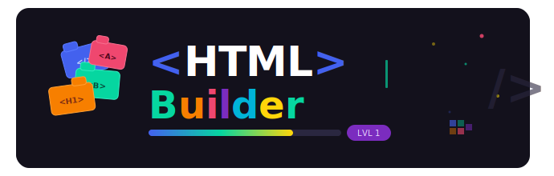

<div align="center">

<strong><h1>HTML Builder</h1></strong>

Plataforma interactiva de aprendizaje de HTML para estudiantes de preparatoria del curso **Cultura Digital II**. Los alumnos aprenden HTML arrastrando bloques de etiquetas, armando estructuras y resolviendo ejercicios con retroalimentación inmediata — sin escribir una sola línea de código.



<br>

</div>

---

## ¿Para qué sirve?

HTML Builder es una herramienta educativa gamificada inspirada en plataformas como Weggo. El objetivo es que adolescentes de 15 años interioricen la sintaxis y la lógica del HTML de forma visual y práctica, cubriendo los capítulos 9 y 10 del libro _Mirar el Futuro que se Convirtió en Presente_.

**No es un editor de código.** No hay consola, no hay errores de compilación, no hay curva técnica de entrada. Solo bloques, preguntas y feedback inmediato.

---

## Secciones del curso

| #   | Tema              | Etiquetas cubiertas                                          |
| --- | ----------------- | ------------------------------------------------------------ |
| 1   | Estructura básica | `<HTML>` `<HEAD>` `<TITLE>` `<BODY>`                         |
| 2   | Formato de texto  | `<B>` `<I>` `<U>` `<S>` `<P>` `<BR>` `<HR>` `<H1>`–`<H6>`    |
| 3   | Fuentes y colores | `<FONT>` SIZE COLOR FACE · BGCOLOR · códigos hex             |
| 4   | Imágenes          | `` SRC ALT WIDTH HEIGHT BORDER · GIF vs JPEG            |
| 5   | Listas            | `<OL>` `<UL>` `<LI>` `<DL>` `<DT>` `<DD>`                    |
| 6   | Enlaces           | `<A>` HREF TARGET · tipos de destino                         |
| 7   | Tablas            | `<TABLE>` `<TR>` `<TD>` `<TH>` `<CAPTION>` · COLSPAN ROWSPAN |
| 8   | Marquesinas       | `<MARQUEE>` direction behavior bgcolor                       |

---

## Tipos de ejercicios

- **Armar estructura** — arrastra bloques de etiquetas al orden correcto dentro de una zona de construcción.
- **Verdadero o Falso** — decide si un enunciado sobre HTML es correcto o incorrecto.
- **Opción múltiple** — selecciona la respuesta correcta entre cuatro opciones.
- **Relacionar columnas** — empareja cada etiqueta con su descripción.

Cada ejercicio muestra feedback inmediato (confetti al acertar, shake al fallar) y una explicación que aparece tras responder.

---

## Stack tecnológico

| Capa        | Tecnología                                   |
| ----------- | -------------------------------------------- |
| UI          | React 19 + TypeScript                        |
| Build       | Vite 8                                       |
| Estilos     | Tailwind CSS v4                              |
| Drag & Drop | @dnd-kit/react + @dnd-kit/dom                |
| Estado      | Zustand (con persistencia en `localStorage`) |
| Routing     | React Router v7                              |

No requiere backend, base de datos ni autenticación. Todo corre en el navegador.

---

## Instalación y uso

### Requisitos

- Node.js 18 o superior
- npm 9 o superior

### Pasos

```bash
# 1. Clona el repositorio
git clone <url-del-repo>
cd aprendiendo-html

# 2. Instala dependencias
npm install

# 3. Inicia el servidor de desarrollo
npm run dev
```

Abre `http://localhost:5173` en el navegador.

### Comandos disponibles

```bash
npm run dev       # Servidor de desarrollo con HMR
npm run build     # Build de producción (genera dist/)
npm run preview   # Vista previa del build de producción
npm run lint      # Revisión de código con ESLint
```

---

## Despliegue

El build genera archivos estáticos en `dist/` que pueden subirse a cualquier hosting sin configuración especial:

```bash
npm run build
```

Compatible con GitHub Pages, Netlify, Vercel o cualquier servidor de archivos estáticos del laboratorio escolar.

---

## Estructura del proyecto

```
src/
├── data/           # Contenido: secciones, ejercicios y catálogo de etiquetas
├── store/          # Store de Zustand (progreso del alumno)
├── types/          # Interfaces TypeScript
├── routes/         # Páginas: Home, Section, Layout
├── components/
│   ├── DragDrop/   # Bloques arrastrables y zonas de drop
│   ├── Exercises/  # TrueFalse, MultipleChoice, MatchPairs
│   ├── Feedback/   # ResultBanner y Explanation
│   ├── Progress/   # ProgressBar y SectionCard
│   └── ui/         # Button y Modal genéricos
└── utils/          # Confetti, validación, colores por categoría
```

Para agregar o modificar ejercicios, edita `src/data/exercises.ts`. Para cambiar el contenido de las lecciones, edita `src/data/sections.ts`. No es necesario tocar ningún componente.

---

## Progreso del alumno

El avance se guarda automáticamente en `localStorage` bajo la clave `html-builder-progress`. El alumno puede cerrar el navegador y retomar donde lo dejó. Desde el header se puede reiniciar todo el progreso con el botón **Reiniciar**.
